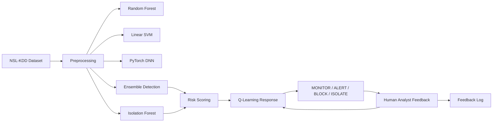

```mermaid
flowchart LR
    A[NSL-KDD Dataset] --> B[Preprocessing]
    B --> C1[Random Forest]
    B --> C2[Linear SVM]
    B --> C3[PyTorch DNN]
    B --> D[Ensemble Detection]
    B --> E[Isolation Forest]
    D --> F[Risk Scoring]
    E --> F
    F --> G[Q-Learning Response]
    G --> H[MONITOR / ALERT / BLOCK / ISOLATE]
    H --> I[Human Analyst Feedback]
    I --> G
    I --> J[Feedback Log]
```